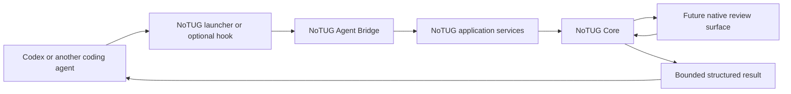
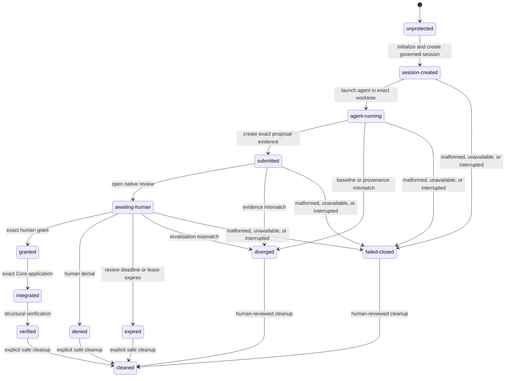

# Agent Bridge foundation

**Status:** bounded non-authorizing launcher/status slice, schema version 1
**Evidence date:** 2026-07-19
**Authority:** NoTUG Core remains the only governance authority

This document records the application-service seam, the first local agent-bridge contract, and the
Codex integration evidence available for this slice. The bridge is a Python adapter, not a Codex
plugin and not a second governance engine.

## Implemented boundary

`application.py` contains typed, terminal-neutral operations. `agent_bridge.py` validates one
versioned JSON object and returns one bounded JSON result. The implemented bridge operations are:

- `capabilities`;
- `repository_status`;
- `create_session`;
- `locate_worktree`;
- `session_state`;
- `review_summary`;
- `verify`.

The version 1 contract also reserves `submit_changes`, `wait_decision`, and `cleanup`, but this slice
returns `unavailable` for them. `create_session` is a non-authorizing local write and requires explicit
`repo` and `name` parameters; it returns the exact managed worktree. There is deliberately no bridge operation
for grant issuance, denial, integration, or revocation. The existing exact interactive human grant
ceremony remains the only authority path.

## Existing core inventory

The existing package already has a strong reusable core. These operations raise `NoTugError` rather
than exiting the process and return dataclasses or structured dictionaries:

| Area | Reusable core operations | Boundary notes |
| --- | --- | --- |
| Git | `run_git`, `discover_repository`, `status_porcelain`, `is_clean`, `resolve_commit`, `worktree_list`, `add_detached_worktree` | `run_git` keeps byte-exact output, no shell, ambient Git-variable cleanup, prompts disabled, and hardened options. |
| Identity and vault | `RepositoryIdentity`, `repository_key`, `Vault`, vault locking and strict path constructors | Repository identity, managed paths, and locks remain Core-owned. |
| Receipts | `EventLedger.append`, `EventLedger.verify`, `ledger_for` | Canonical hash-chain validation and minimisation remain Core-owned. |
| Initialization and sessions | `initialize_repository`, `start_session`, `find_session`, `load_session`, `verify_session_worktree`, `verify_authoritative_baseline` | Bridge session creation is mutating but non-authorizing and returns the exact worktree. |
| Agent execution | `run_agent_command` | Runs directly in the session worktree and does not scrape CLI output. Recognized Codex launches receive an explicit exact `-C`; conflicting workdir options fail before launch. It remains unexposed through the JSON bridge. |
| Change evidence | `prepare_snapshot`, `changes_to_dict`, `evaluate_policy` | Structural Git/filesystem reconciliation remains Core-owned. |
| Tug Signals | `generate_tug`, `find_tug`, `validate_tug`, `verify_tug_artifacts`, `full_diff_text` | Generation mutates local evidence; review and verification are reusable read operations. |
| Disposition | `deny_tug`, `grant_tug`, `revoke_grant`, `validate_grant` | Authorizing and integrating calls remain outside the bridge. `grant_tug` rejects agent/validation context and requires an exact interactive TTY confirmation. |
| Verification | `verify_repository`, `require_verified` | Full provenance verification is reusable and terminal-neutral. |
| Diagnostics and demo | `diagnose`, `run_demo` | Diagnostics use a temporary writability probe. The demo owns a synthetic repository and a deliberately synthetic confirmation context. |

## Terminal-coupled inventory

The following logic is adapter logic rather than the shared service seam:

- `cli._parser` and `argparse.Namespace` construction;
- `cli._dispatch`, command-specific human text, JSON printing, and numeric return codes;
- `cli.main`, `KeyboardInterrupt` handling, unexpected-error masking, and process-exit mapping;
- `cli._print_review` and terminal sanitization of untrusted paths and messages;
- `grants._interactive_confirmation`, which reads `stdin`, writes `stderr`, checks TTY state, and
  requires the exact `GRANT <tug-hash>` phrase;
- `process.run_sanitized_process`, which streams child output to human terminals;
- demo progress rendering and the isolated demo-only synthetic TTY.

The CLI review command obtains verified review facts from `application.get_review_summary`, then adds
its own printable `grant` and `deny` command hints before rendering. The application model contains no
CLI branding or command strings. The CLI omits the application-only `session_state` field so its
existing human and JSON review shape remains unchanged. Future Desktop code should call the same
application service, never `_dispatch`, `main`, or the console executable.

## Application-service rules

The selected seam has these rules:

1. Services accept Python values such as `Path`, identifiers, and an optional `Vault`.
2. Services return frozen dataclasses with `to_dict()` methods.
3. Services raise `NoTugError`; they never call `sys.exit` or format terminal prose.
4. Services import no CLI adapter, GUI toolkit, or Codex package and manufacture no adapter-specific
   command strings.
5. Git and provenance work is delegated to existing hardened Core operations.
6. Read-only and explicitly non-authorizing session-creation services are grouped in `application.py`.
   Authorizing services are not wrapped or exported by the bridge.
7. Constructing a result dataclass has no side effect and cannot create a receipt, grant, branch, or
   worktree.

## Observed Codex hook capabilities

The repository has an empty `.agents/` directory, one root `AGENTS.md`, no project `.codex/` layer,
no `hooks.json`, no project skill, and no hook script. The installed desktop package exposes a
`codex.exe` path, but this session could not execute that binary because Windows denied access even
for a read-only version probe. No hook was installed or enabled for this investigation.

The following table records current documented behavior from the official
[Codex hooks reference](https://developers.openai.com/codex/hooks). It does not infer capabilities
beyond that reference.

| Question | Documented or observed answer |
| --- | --- |
| Lifecycle events | `SessionStart`, `SubagentStart`, `PreToolUse`, `PermissionRequest`, `PostToolUse`, `PreCompact`, `PostCompact`, `UserPromptSubmit`, `SubagentStop`, and `Stop`. |
| Configuration | `hooks.json` or inline `[hooks]` beside active config layers. Useful locations are user `~/.codex/{hooks.json,config.toml}` and project `<repo>/.codex/{hooks.json,config.toml}`. Plugins and managed `requirements.toml` can also contribute hooks. |
| Trust | Non-managed command hooks are skipped until their exact current definition is reviewed and trusted. Project hooks also require a trusted project layer. Hooks are enabled by default but can be disabled unless managed policy pins them. |
| Handler type | Only synchronous `type = "command"` handlers run today. Parsed `prompt`, `agent`, and asynchronous handlers are skipped. Multiple matching command hooks launch concurrently. |
| Common input | One JSON object on `stdin`, including `session_id`, nullable `transcript_path`, `cwd`, `hook_event_name`, and `model`; applicable events also include `permission_mode`, and turn-scoped tables include `turn_id`. The transcript format is explicitly not stable. |
| Tool input | `PreToolUse` includes `tool_name`, `tool_use_id`, and `tool_input`; `PostToolUse` adds `tool_response`. Shell and unified exec match as `Bash`; `apply_patch` reports `apply_patch`; MCP and most other local function tools use their tool names. |
| Pre-tool blocking | A covered call can be denied with `hookSpecificOutput.permissionDecision = "deny"`, the legacy `decision = "block"`, or exit code 2 with a reason on `stderr`. Supported input can also be rewritten with an allow decision plus `updatedInput`. |
| Post-tool behavior | It runs after the covered tool. Blocking feedback can replace or reject delivery of the result, but cannot undo side effects that already occurred. |
| Failure behavior | Exit 0 with no output succeeds. Unsupported output fields mark that hook run failed; for documented PreToolUse output errors, Codex reports the error and continues the tool call. This is not fail-closed governance. |
| Timeout | `timeout` is seconds; the default is 600 seconds. |
| Working directory | Hook commands run with the session `cwd`. Repo-local scripts should resolve from the Git root because Codex can start in a subdirectory. |
| Environment variables | The general hook reference documents input on `stdin`, not a stable general hook-specific environment-variable set. Plugin hooks additionally receive `PLUGIN_ROOT`, `PLUGIN_DATA`, `CLAUDE_PLUGIN_ROOT`, and `CLAUDE_PLUGIN_DATA`. |
| Windows | `commandWindows` is available in JSON; TOML accepts `command_windows` or `commandWindows`. Managed configuration has `windows_managed_dir`. This is configuration support, not proof that every GUI or script works in every Windows session. |
| Native review application | A synchronous command handler can remain running until completion or timeout. The reference does not promise that a hook can display, focus, or interact with a native GUI in every host/session. A launcher may be able to wait for a local review process, but that requires a separate Windows probe. |
| Starting in a NoTUG worktree | Codex documents `codex --cd <path>` as setting the agent working directory, and hooks receive that session `cwd`. The installed binary could not be exercised in this session, so exact CLI/Desktop startup inside a NoTUG worktree remains unverified here. |

### Can hooks prevent direct writes?

Only for a covered call that actually reaches `PreToolUse` and returns a supported deny result. The
current reference covers shell/unified exec, `apply_patch`, MCP tools, and most local function tools,
but explicitly says hosted tools are not covered and specialized paths can opt out. A permitted shell
or process can also perform many internal writes after its one outer tool call is admitted. Trust
review, feature-disable controls, unsupported-output fail-open behavior, and concurrent matching hooks
further prevent a project hook from being the sole authority boundary.

Therefore this slice does not claim that Codex hooks can preserve the protected-checkout invariant.

## Enforcement-model comparison

| Model | Before-write protection | Coverage dependency | Protected-checkout invariant |
| --- | --- | --- | --- |
| A. Post-hoc hook validation | None; validation occurs after a write | Requires every relevant post-tool event and cannot undo effects | Insufficient |
| B. Pre-route into a NoTUG disposable worktree | Agent starts with the disposable worktree as `cwd`; ordinary writes land outside the protected checkout | Depends on correct launcher/worktree selection, then on existing NoTUG provenance checks | Strongest available foundation |
| C. Routing plus hook verification | Same routing boundary as B, with hooks checking session identity, worktree location, or post-tool drift | Hook gaps remain, but a missed hook does not become the primary isolation boundary | Recommended defence in depth after a probe |

**Recommendation:** use B as the required enforcement model and evolve to C only as defence in
depth. A NoTUG-owned launcher should create or select the session first and start Codex with the exact
session worktree as `cwd`. Optional hooks may fail closed when they detect a mismatch, but their
absence must never route work into the protected checkout.

## Proposed call path



The future review surface displays Core-derived evidence. It does not return a grant object for the
GUI to save. A human-authorizing Core method must perform the exact evidence revalidation and record
the authoritative receipt itself.

## Lifecycle state machine

The bridge vocabulary is intentionally broader than the current Core `State` enum. Dashed states are
contract-level future states and do not imply an implemented transition.



## Bridge contract version 1

Every request has exactly four fields:

```json
{
  "schema_version": 1,
  "operation_id": "op_local_001",
  "operation": "repository_status",
  "parameters": {"repo": "fixture-repository"}
}
```

Every response contains `schema_version`, the same `operation_id`, the operation, `ok`, an `outcome`,
structured `data`, and either a structured `error` or `null`:

```json
{
  "schema_version": 1,
  "operation_id": "op_local_001",
  "operation": "repository_status",
  "ok": true,
  "outcome": "ok",
  "data": {},
  "error": null
}
```

Unknown top-level fields, unknown parameter fields, missing fields, wrong types, unknown operations,
and unknown schema versions fail closed. Defined but unimplemented operations return `unavailable`.
Unexpected exceptions are masked as `BRIDGE_INTERNAL_ERROR`; interruptions return `interrupted`.

`repo` is required for `repository_status` and `verify`; the bridge never substitutes the process
working directory. The supplied path is passed as a `Path` to the application service. `session_id`
and `tug_id` use NoTUG Core's opaque identifier validator, while `repo` remains a path value and is
not subjected to path-free identifier validation.

`review_summary` verifies the Tug artifacts, receipt chain, and receipt-bound session head. It remains
available as a read-only audit view after disposition. Its outcome is derived from the verified
session state: `TUGGED` is `awaiting_human`, `DENIED` is `denied`, `GRANTED` is `granted`, and
`APPLIED` is `integrated`; other existing session states use the shared session-outcome mapping.

Result outcomes include `unprotected`, `session_created`, `agent_running`, `submitted`,
`awaiting_human`, `granted`, `denied`, `expired`, `diverged`, `interrupted`, `unavailable`,
`failed_closed`, `integrated`, `verified`, and `cleaned`. Not every outcome is produced by this
foundation slice.

## Threat boundaries

- The bridge is not a kernel, privilege, malware, or same-user containment boundary.
- Agent input, hook input, prompts, paths, diffs, command output, and native-window text remain
  untrusted data.
- A bridge result is not a receipt and conveys no authority.
- The bridge cannot construct or persist a grant.
- A malformed request, unsupported version, unavailable operation, unexpected exception, baseline
  drift, or provenance error produces no authorizing fallback.
- Local hook trust and coverage are weaker than NoTUG Core evidence and cannot replace it.
- A launcher must not silently fall back to the protected checkout if session creation or agent launch
  fails.

## Unresolved uncertainties

1. A Windows Node/Codex run without explicit `-C` started its first PowerShell child at `C:\`; the
   ordinary NoTUG child CWD was independently verified as the exact AppData session worktree. The
   launcher now adds exact explicit Codex workdir binding, but a fresh external-agent proof remains.
2. Native GUI launch, focus, wait, cancellation, and timeout behavior from a Windows command hook are
   not documented as a stable cross-surface contract.
3. The hook reference warns that specialized tool paths may bypass normal tool hooks; the exact set
   can vary by release.
4. Core has no `EXPIRED` state yet. Expiry semantics need a separate protocol decision before code.
5. NoTUG currently uses a TTY-bound grant ceremony. A native human ceremony needs a Core-owned,
   unforgeable authorization channel; a GUI-created Python object is insufficient.
6. Cancellation-safe waiting and process-lifetime ownership for Desktop/Codex have not been designed.

## Completed launcher slice and next proof

The bounded implementation now:

1. exposes `create_session` through a dedicated non-authorizing application service and returns the
   exact worktree;
2. launches user-selected agents with that exact worktree as `cwd`, and additionally binds recognized
   Codex CLI/Node entry points with `-C` rather than falling back to another workspace;
3. rejects a conflicting Codex workdir before child launch or durable run evidence.

The next proof should:

1. run an isolated Windows probe that records the observed Codex version, `--cd` behavior, hook trust,
   `SessionStart`/`PreToolUse` payloads, deny semantics, timeout, interruption, and native-process wait;
2. add protected-checkout before/after manifests around the probe;
3. expose polling-only `session_state`/`review_summary` to a minimal native review prototype, still
   without grant, deny, integration, revocation, or cleanup authority.

Stop again for human review before designing the native grant ceremony.
