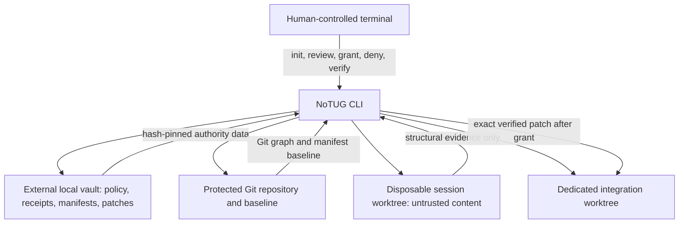

# Architecture

This document defines the implemented `0.1` architecture. Measured release evidence is tracked in
[../STATUS.md](../STATUS.md).

## Purpose

NoTUG is a local mutation-governance layer for coding-agent changes. It separates proposal
from authority: an untrusted session may produce a patch and evidence, but a distinct human ceremony is
required before the exact reviewed patch can become a NoTUG integration branch.

The authoritative Git repository plus its recorded baseline commit form **Node 0**, the authority root.
The protected primary checkout is never a supported agent working directory.

## Trust domains

- **Authority domain:** repository identity, baseline commit, authoritative vault policy, and explicit
  grant input.
- **Untrusted data domain:** filenames, source, diffs, commit messages, command output, and all session
  workspace content. These are data even when they contain imperative language.
- **Evidence domain:** canonical receipts, manifests, patches, and Tug Signals. They are validated and
  hash-bound before use; event text is never executed.
- **Integration domain:** a generated worktree and collision-safe branch that receive only a preflighted,
  exact reviewed patch.

## Components

The package centralizes runtime public identity in `brand.py` so display and namespace choices remain
separate from protocol mechanics. Distribution/script metadata, the Python import package, and stable
on-disk compatibility identifiers still require deliberate rename work. The CLI routes commands but
leaves business rules in focused modules:

- identity and Git adapters validate repositories, baseline objects, branches, worktrees, and drift;
- vault services choose an OS-appropriate path outside the protected repository and perform atomic I/O;
- configuration strictly parses the versioned TOML policy and rejects unknown fields;
- manifest services hash raw tracked/workspace bytes with SHA-256 while retaining type, size, Git mode,
  and object identities;
- event services canonicalize JSON, append the previous hash, and verify the entire receipt chain;
- session services create detached linked worktrees and record minimised command-operation artifacts;
- change and policy services reconcile Git diff, raw status, filesystem facts, and thresholds;
- Tug services create the binary-capable patch, evidence bundle, risk summary, and canonical signal;
- grant services preflight and apply to a dedicated integration branch, then verify the result;
- verification services audit stored artifacts, reverse-map managed worktree/ref resources, and always
  produce valid JSON in `--json` mode;
- export services generate patch-free JSON receipts with scoped path aliases by default;
- demo services operate only on a newly created temporary repository.
- application services provide typed, terminal-neutral lifecycle results to local adapters;
- the optional Leucoform Qt adapter supplies desktop interaction without moving authority out of Core;
- the cancellable runner streams sanitized process output and carries prompts only through bounded stdin.

## Evidence lattice

No single view of state is sufficient. At session creation, NoTUG records the baseline commit and a
SHA-256 manifest of tracked files. A baseline tree containing any tracked symlink is rejected with
`UNSAFE_BASELINE_SYMLINK` before the session worktree is created. At Tug time NoTUG captures raw
workspace bytes and metadata, obtains Git status, raw diff metadata, statistics, a staged snapshot tree,
and a binary-capable patch. It checks that:

1. the original commit still exists and matches recorded identity;
2. tracked baseline files agree with the pinned manifest;
3. each captured workspace entry retains the same raw SHA-256, type, size, and executable mode when
   reread for reconciliation;
4. Git's staged blob and tree model agrees with those raw facts after only built-in attribute
   normalization such as text/end-of-line conversion;
5. proposed symlinks are classified and outside-workspace targets are blocked by default;
6. every populated Gitlink matches its staged commit pointer and contains no tracked, untracked, or
   ignored local change; and
7. stored signal, patch, policy, and receipt hashes bind the same proposal.

Disagreement produces a stable divergence error rather than a best guess. Grant repeats these checks and
adds repository-drift detection plus `git apply --check` or an equivalent no-write preflight. External
clean/smudge filter programs, repository hooks, and custom merge drivers are inert during these protocol
operations; Git's built-in normalization is modeled with `hash-object --path` so normal text/EOL
transformations do not create a false divergence.

## State and transactions

The protocol uses explicit states: `LOCKED`, `SESSION_OPEN`, `TUGGED`, `GRANTED`, `APPLIED`, `DENIED`,
`ABANDONED`, `REVOKED`, `DIVERGED`, and `FAILED`. Invalid transitions fail with a stable code. Mutation Lock is the
default externally visible condition and is restored after successful and failed operations. Mutating
operations acquire a per-repository vault lock before re-reading state and recording a transition, so
two local CLI processes cannot both act on the same stale transition through the supported path.

Grant confirmation is dependency-injected only inside the trusted local application boundary. The CLI
provider reads an interactive TTY; Leucoform provides the exact native field value. Both enter a shared
locked Core function that revalidates all evidence before mutation. Agent Bridge has no provider and no
grant capability.

Application is transactional at the workflow level:

1. validate all authority and evidence;
2. allocate a collision-safe integration branch and worktree without removing existing resources;
3. preflight and apply the exact patch;
4. run configured validation commands;
5. verify resulting structure;
6. commit receipt identifiers and append the application receipt.

A failure before the verified commit does not authorize a partial result. Cleanup is limited to resources
proven to belong to that operation; unrelated branches and worktrees are never deletion candidates.

Critical Git operations use argv execution without a shell, a trusted empty hooks directory, and inert
overrides for discovered clean/smudge filter drivers and custom merge drivers. This prevents
repository-controlled hooks, filters, and merge commands from becoming implicit steps in NoTUG's
snapshot, worktree, apply, commit, and revert path.
It does not sandbox user-supplied commands or prove that Git, validation tools, or every host-level
configuration source is benign.

Verification supplies the read-only crash-consistency backstop. It starts from completed receipts and
strict session/grant artifacts, derives the managed resources they may or must own, and reverse-maps every
actual session, integration, and revert worktree directory and Git registration plus generated grant,
revert, and revocation-evidence refs. Missing required resources, unclaimed resources, link/reparse
redirects, and failed-grant residue produce stable findings. Verification does not delete, prune, or
silently repair those resources.

## Receipt exports

`notug export` verifies the stored Tug artifacts and receipt chain before producing canonical JSON. The
export binds the source Tug and patch hashes, baseline and evidence summaries, policy classifications,
risk, and current chain head, but never embeds patch bytes. Paths become deterministic aliases scoped to
the Tug hash unless the user explicitly selects `--include-paths`; symlink targets remain redacted in the
default form. Exports are disclosure artifacts, not authority, and cannot be written inside the protected
repository by the CLI.

## Linked-worktree nuance

Git linked worktrees isolate working directories, indexes, and worktree-local `HEAD`, but share a common
object database and many refs. A normal file edit in the disposable worktree does not edit the protected
checkout. Commands such as `git add` or `git commit` can add objects to the common database, and a process
with sufficient filesystem permission could address shared refs directly.

Accordingly, NoTUG governs the supported path from disposable edits to authorized integration refs. It
does not claim storage-level separation or containment of hostile processes. For stronger isolation,
run the agent in an independently administered OS/container/VM boundary and treat that as an additional
control, not a feature supplied by version `0.1`.

## Local-only design

The runtime has no account, telemetry, analytics, cloud control plane, or remote API. The vault holds the
minimum operational artifacts locally. Ordinary events omit file bodies and environment variables;
patch bodies remain in the vault only because exact review and application require them. User-supplied
commands are outside this guarantee and may have their own networking or logging behaviour.

See [PROTOCOL.md](PROTOCOL.md), [THREAT-MODEL.md](THREAT-MODEL.md), and [PRIVACY.md](PRIVACY.md).
